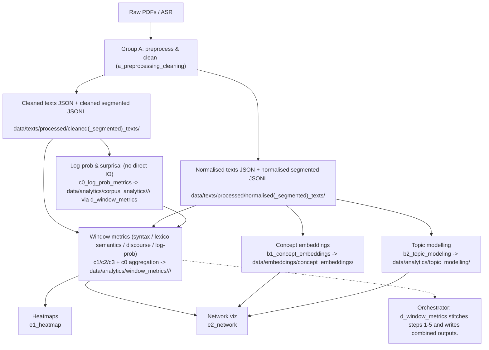
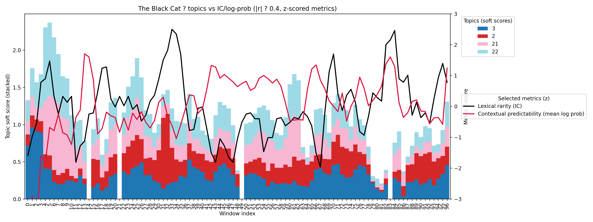
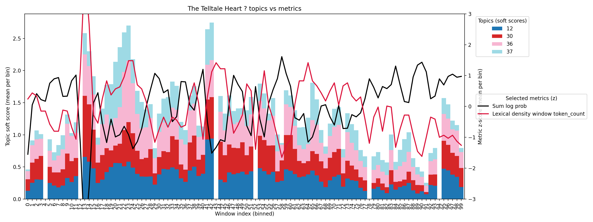

# Textual Emphasis Analysis

Python 3.10

## Overview
The pipeline analyzes textual emphasis using linguistic metrics, topic modeling, embeddings, and visualization. Windowed metrics are computed over sliding sentence windows (default size 3, stride 1) so syntax/lexico-semantics/discourse/surprisal can be aligned to topic windows and compared across shared sentence indices.

## Architecture flow

## Metric rationale

The study's core aim is to localize and compare textual emphasis across a document by checking whether central topics align with variation in semantic, lexical, discourse, and log-probability signals. The B and C modules were chosen because they capture complementary signals that can be aligned to shared sentence windows, so we can test whether (for example) surprisal or syntactic complexity rises when key topics are discussed. Concretely, each window aggregates per-sentence metrics and can be compared against a topic window (e.g., a 3-sentence window where the topic model flags a dominant theme) to ask: do semantic/lexical/discourse/log-probability measures shift when a central topic is active?

Group B: conceptual emphasis signals
b1_concept_embeddings (noun-phrase embeddings + clustering)
Metrics taken: extracted noun phrases (top-N by frequency), sentence-transformer embeddings, HDBSCAN cluster labels.
Why: repeated or clustered concepts are a direct indicator of emphasis.
Used for: building a concept inventory and locating concept clusters across the text.
Relation to study: concept clusters define what is emphasized; window-level metrics can be compared against the presence of these clustered concepts.

b2_topic_modeling (windowed topic clusters + keywords)
Metrics taken: sentence/window embeddings, HDBSCAN topic labels, TF-IDF keywords, localized topic mentions (sentence indices and character spans).
Why: topic clusters capture thematic concentration.
Used for: generating a topic timeline and locating where topics are discussed.
Relation to study: provides the anchor for alignment; topic-active windows are compared with lexical, discourse, syntactic, and log-probability variation.

Group C: linguistic, probabilistic, and discourse emphasis signals
c0_log_prob_metrics (log-probability, surprisal, perplexity)
Metrics taken: per-sentence log-prob sums/means, per-sentence perplexity, mean surprisal, surprisal variance, plus windowed aggregates; orchestrator writes the corpus JSONs to data/analytics/corpus_analytics/<category>/<name>/.
Why: emphasis can coincide with less predictable language or stylistic foregrounding.
Used for: identifying unexpectedness peaks across sentence windows.
Relation to study: tests whether windows with central topics show higher surprisal or shifts in predictability compared to surrounding windows.

c1_syntactics (clause counts, depth, dependency complexity)
Metrics taken: main/subordinate/coordinate clause counts and ratios, max/mean/median depth, depth skew, dependents-per-head, mean dependency distance, plus windowed aggregates.
Why: syntactic complexity often increases with emphasis or rhetorical focus.
Used for: tracking structural intensity across the text.
Relation to study: checks whether topic-active windows show higher complexity (e.g., more subordination or deeper parses).

c2_lexico_semantics (lexical density, information content, roles)
Metrics taken: lexical density (content vs. total tokens), information content from corpus frequencies, MATTR (lexical diversity), average word frequency/normalized frequency, semantic role counts, agent/patient counts, plus windowed aggregates.
Why: emphasized segments tend to be lexically dense, information-rich, and semantically loaded.
Used for: quantifying semantic weight and lexical intensity.
Relation to study: tests whether topic-active windows coincide with higher density, higher information content, or richer role structure.

c3_discourse (connectives, overlap, pronouns, tense shifts)
Metrics taken: explicit connective counts by relation type, entity/content overlap ratios, pronoun ratio, tense shifts, dominant relation, plus windowed aggregates.
Why: discourse shifts and cohesion patterns often signal emphasis or topic transitions.
Used for: detecting rhetorical transitions and cohesion changes.
Relation to study: evaluates whether topic transitions align with discourse-level shifts (e.g., new connectives or reduced overlap).

Together, these metrics support a multi-layer alignment analysis: what is emphasized (concepts/topics), how it stands out (surprisal, density, structure), and where it occurs (windowed alignment across signals).
Example: if a 3-sentence window is labeled with a dominant topic and shows a spike in mean surprisal plus higher lexical density, that suggests the topic is being emphasized through both semantic concentration and probabilistic unexpectedness.

Dashboard metric set (pruned from window outputs)
- Discourse: explicit connectives per token, connective counts per token (Temporal/Contingency/Comparison/Expansion), entity/content overlap ratios, pronoun ratio.
- Lexico-semantics: lexical density, content-function ratio, clauses/agents/patients per token, role counts per token (nsubj/dobj/iobj/pobj) and total.
- Syntax: clause counts per token (main/subordinate/coordinate), clause ratios (subordination/coordination), dependents per head (main/subordinate/coordinate), mean dependency distance, mean/median/max depth, depth skew, avg tokens per sentence.
- Unexpectedness: token-weighted mean surprisal, token-weighted surprisal variance.

## Topic modeling notes

Topic modeling defaults and statistics
- Embedding normalization: window/sentence embeddings are L2-normalized; mean topic centroids are L2 re-normalized before cosine similarity so scores stay on the unit sphere.
- Dimensionality reduction: PCA runs before HDBSCAN (default 50 components; per-book overrides in metadata/x_configs).
- Topic scoring defaults: soft top-k scoring with soft_top_k_topics=3 and soft_score_threshold=0.5; default window stride is 6; TOPIC_WINDOW_MULTIPLES=3 across categories. Dashboard correlations use hard topic labels by default, unless configured to use soft scores.
- n-grams: topic modeling includes bi/tri-grams in keyword extraction.
- Top-word overlap policy: optional downweighting/deduping of top words that recur across many clusters to improve exclusivity (documented here once finalized).

Topic metrics and correlation statistics
- Prevalence: how often a topic appears across sliding windows (topic coverage over the text).
- Coherence: interpretability of a topic; do top words co-occur together in real usage (e.g., ship/sea/sail/captain)?
- Exclusivity: distinctiveness of a topic; are top words specific to one topic rather than shared across many?
- Significance testing: correlations use block bootstrap p-values; outputs are written alongside correlations in data/analytics/dashboard/**/*_topic_correlations.json and data/analytics/dashboard/**/*_central_topic_correlations.json.

## Data layout

- `data/texts/processed/cleaned_texts/<category>/*_cleaned.json`: inputs for corpus/window metrics (full text under `text` key).
- `data/texts/processed/normalised_texts/<category>/*_normalised.json`: inputs for concept embeddings/networking (full text under `text` key).
- `data/texts/processed/cleaned_segmented_texts/<category>/*_cleaned_segmented.jsonl` and `data/texts/processed/normalised_segmented_texts/<category>/*_normalised_segmented.jsonl`: sentence-level JSON Lines.
- `data/analytics/corpus_analytics/<category>/<name>/*_metrics.json`: corpus log-prob/surprisal outputs from c0 (written via the orchestrator).
- `data/analytics/window_metrics/<category>/<name>/*_metrics.json`: combined outputs from the orchestrator (syntax, lexico-semantic, discourse, log-prob windows).
- `data/analytics/topic_modelling/`, `data/embeddings/concept_embeddings/`, `data/graphs/{network_analysis,syntactic_graphs}/`: downstream artifacts from group B/C/E modules.
- Raw PDFs expected under `data/texts/raw/` (organized by genre/author, e.g. `gothic/poe`); other intermediate folders can be added as preprocessing requires.

## Preliminary findings

### Short stories

#### The Black Cat

- Stacked soft topic scores per window (top 5 topics by |r| for the selected metrics); right axis: z-scored metrics (lexical rarity, mean log-probability); topics filtered to |r| >= 0.3 with either metric.
- Topics visible (keywords): Topic 2 - run; run fail; fail; fail anger; anger; anger run; near; new feeling | Topic 3 - tomorrow die; tomorrow; die; today want; today; happen; happen free; soul horrible | Topic 21 - man; love; love animal; animal; learn; man quite; young marry; somet love | Topic 22 - animal; man; listen; learn; love animal; love; destroy child; hear destroy
- Observation: Topic 3 shows strong negative correlation with contextual predictability (mean log-probability), while Topics 2/21/22 align with higher lexical rarity (information content), suggesting emphasis spikes when these motifs surface.

Top correlations (|r| >= 0.3, non-positional)
- Topic 3 - perplexity up (r=+0.78), mean_surprisal up (r=+0.66), mean_log_prob down (r=-0.66); keywords: tomorrow die; tomorrow; die; today want; today; happen. Interpretation: "fatal tomorrow" motif coincides with less predictable, more surprising language.
- Topic 0 - contingency connectives up (r=+0.65); keywords: hang; know; love; outside reach; place soul; deadly place. Interpretation: "hanging/doom" motif framed with more causal/contingency linking.
- Topic 1 - contingency connectives up (r=+0.50); keywords: law; time; time push; human; time wrong; human time. Interpretation: "law/time/pressure" motif accompanied by more causal connectives.
- Topic 18 - depth skew flatter (r?-0.49); keywords: stone; single; quite impossible; single stone; impossible; place pleased. Interpretation: "stone/impossible" motif links to more balanced dependency depth.
- Topic 2 - comparison connectives up (r?+0.44); keywords: run; run fail; fail; fail anger; anger; anger run. Interpretation: comparison linking rises with this motif.

#### The Tell-Tale Heart

- Stacked soft topic scores per binned window (mean per bin); right axis: z-scored metrics (sum log-probability, lexical density window token count); topics filtered to |r| >= 0.3 (non-positional) and top by |r|.
- Topics visible: multiple active topics (e.g., Topic 36) that meet the filter.

Top correlations (|r| >= 0.3, non-positional)
- Topic 36 - sum_log_prob down (r=-0.52); token counts up (r?+0.50); keywords: eye; eye evil; kill eye; man feel; evil; feel kill. Interpretation: ?evil eye? motif co-occurs with longer, less probable spans.
- Topic 23 - explicit_connectives up (r=+0.47); keywords: plan; madman plan; madman; mad madman; think mad; think; mad; plan week. Interpretation: ?madman plan? motif uses more explicit discourse connectives.
- Topic 18 - surprisal variance up (r?+0.44); keywords: eye; like; blue; blue eye; like ice; body like. Interpretation: ?blue eye? motif shows higher surprisal variability.
- Topic 14 - content overlap ratio up (r?+0.46); keywords: 34; like 34; cat pluto; pluto pet; pet like; like. Interpretation: higher content overlap when this motif appears.
- Topic 6 - lexical metrics up (r?+0.47 across lexical windows); keywords: end; search; know; quietly expect; win battle; end end. Interpretation: lexical load rises with this motif.

### Novellas

*(Bar/line plots omitted here; trends are less observable in longer texts.)*

#### The Metamorphosis

Top correlations (|r| >= 0.3, non-positional)
- Topic 5 - lexical window metrics (mattr/lexical_density/information_content windows) r?+0.44; keywords: samsa; mr samsa; mr; landing; samsa woman; man. Interpretation: ?Samsa/household? motif carries consistent lexical window signatures.
- Topic 41 - entity_overlap r?+0.35; keywords: gregor; sister; window; sheet; couch; come room. Interpretation: higher entity cohesion with this motif.
- Topic 30 - content/entity overlap r?0.33?0.34; keywords: sister; gregor; maid; food; help; mother. Interpretation: shared content/entities rise with this motif.
- Topic 3 - lexical frequency/rarity (avg_word_freq, normalized_freq, MATTR span) r?-0.33 to -0.35; keywords: quite alright; night; alright; know; quite; illness. Interpretation: rarer words/longer spans with this motif.
- Topic 6/37 - weaker (~0.30?0.31) signals in discourse/lexical features (e.g., pronoun_ratio, explicit_connectives).

#### The Dead

Top correlations (|r| >= 0.3, non-positional)
- Topic 11 - mean_surprisal down / mean_log_prob up (|r|?0.34); keywords: good night; night; good; annoy; night gretta; night miss. Interpretation: this motif shows mild predictability shifts, but effects are modest.

## Notes

- Set `x_configs.model` to the desired causal LM before running log-prob metrics.
- Several modules still have TODOs and may assume corpus frequency data exists.
- Tests are not present yet; `pytest` is included in `requirements.txt` for future coverage.
- Topic modeling defaults, metrics, and correlation details live in the pipeline modules and configs.
