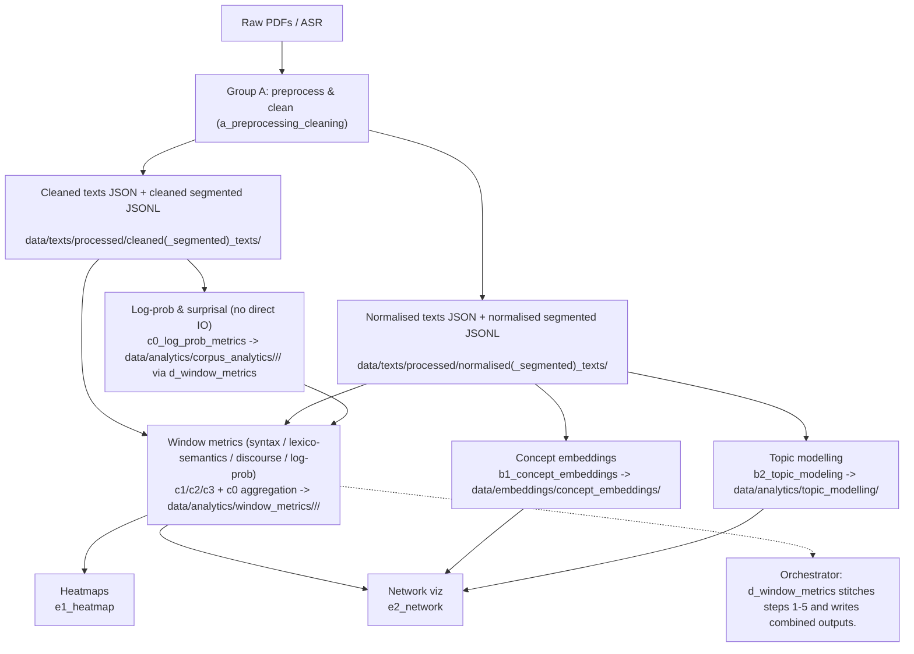

# Textual Emphasis Analysis

Python 3.10

A pipeline for analyzing textual emphasis with linguistic metrics, topic modeling, embeddings, and visualization. Most metrics operate on sliding windows of sentences so they can be aligned with topics and network structures.

## Module groups

- **Group A - preprocessing/cleaning** (`src/a_preprocessing_cleaning.py`): spaCy tokenization/lemmatization, whitespace cleaning, PDF extraction with per-book configs, optional Whisper ASR; writes cleaned/normalised text variants to `data/texts/processed/{cleaned,cleaned_segmented,normalised,normalised_segmented}_texts/` (JSON/JSONL).
- **Group B - whole-text embeddings and topics**
  - `src/b1_concept_embeddings.py`: noun-phrase extraction, sentence-transformer embeddings, HDBSCAN clustering; saves to `data/embeddings/concept_embeddings/`.
- `src/b2_topic_modeling.py`: sentence-level embeddings, windowed clustering, TF-IDF keywords, topic mentions; saves to `data/analytics/topic_modelling/`.
- **Group C - corpus + sentence/window analytics**
  - `src/c0_log_prob_metrics.py`: Hugging Face causal LM log-probability/surprisal/perplexity per sentence and window (no direct I/O; orchestrator writes to corpus JSON via `x_configs.model`).
  - `src/c1_syntactics.py`: dependency depth, clause counts, complexity, syntactic graphs (`data/graphs/syntactic_graphs/`).
  - `src/c2_lexico_semantics.py`: lexical density/frequency/cohesion; supports corpus frequency merging.
  - `src/c3_discourse.py`: discourse markers, entity overlap, pronoun/tense shifts; aggregates per window.
- **Group D - orchestration**
  - `src/d_window_metrics.py`: full pipeline runner. Steps: (1) preprocess PDFs to cleaned/normalised text; (2) concept embeddings from normalised text; (3) topic modelling from normalised-segmented JSONL; (4) corpus log-prob metrics from cleaned text; (5) combined window metrics (syntax + lexico-semantic + discourse + info content) to `data/analytics/window_metrics/<category>/<name>/`.
- **Group E - visualization**
  - `src/e1_heatmap.py`: heatmaps over windowed metrics.
  - `src/e2_network.py`: network views across topic/syntax/lexico-semantic outputs.
- **Shared helpers**: `src/x_configs.py` (spaCy loader defaults, window size, model placeholder) and `src/z_utils.py` (sliding-window aggregation, JSON/path helpers for texts, embeddings, graphs, topics).

## Architecture flow

## Why these metrics are included (focus on emphasis)

The study's core aim is to localize and compare *textual emphasis* across a document by checking whether **central topics** align with variation in semantic, lexical, discourse, and log-probability signals. The B and C modules were chosen because they capture complementary signals that can be aligned to shared sentence windows, so we can test whether (for example) surprisal or syntactic complexity rises when key topics are discussed. Concretely, each window aggregates per-sentence metrics and can be compared against a topic window (e.g., a 3-sentence window where the topic model flags a dominant theme) to ask: *do semantic/lexical/discourse/log-probability measures shift when a central topic is active?*

### Group B: conceptual emphasis signals

- **b1_concept_embeddings (noun-phrase embeddings + clustering)**  
  **Metrics taken:** extracted noun phrases (top-N by frequency), sentence-transformer embeddings, HDBSCAN cluster labels.  
  **Why:** repeated or clustered concepts are a direct indicator of emphasis.  
  **Used for:** building a *concept inventory* and locating concept clusters across the text.  
  **Relation to study:** concept clusters define *what* is emphasized; window-level metrics can be compared against the presence of these clustered concepts.

- **b2_topic_modeling (windowed topic clusters + keywords)**  
  **Metrics taken:** sentence/window embeddings, HDBSCAN topic labels, TF-IDF keywords, localized topic mentions (sentence indices and character spans).  
  **Why:** topic clusters capture thematic concentration.  
  **Used for:** generating a topic timeline and locating where topics are discussed.  
  **Relation to study:** provides the anchor for alignment; topic-active windows are compared with lexical, discourse, syntactic, and log-probability variation.

### Group C: linguistic, probabilistic, and discourse emphasis signals

- **c0_log_prob_metrics (log-probability, surprisal, perplexity)**  
  **Metrics taken:** per-sentence log-prob sums/means, per-sentence perplexity, mean surprisal, surprisal variance, plus windowed aggregates; orchestrator writes the corpus JSONs to `data/analytics/corpus_analytics/<category>/<name>/`.  
  **Why:** emphasis can coincide with less predictable language or stylistic foregrounding.  
  **Used for:** identifying unexpectedness peaks across sentence windows.  
  **Relation to study:** tests whether windows with central topics show higher surprisal or shifts in predictability compared to surrounding windows.

- **c1_syntactics (clause counts, depth, dependency complexity)**  
  **Metrics taken:** main/subordinate/coordinate clause counts and ratios, max/mean/median depth, depth skew, dependents-per-head, mean dependency distance, plus windowed aggregates.  
  **Why:** syntactic complexity often increases with emphasis or rhetorical focus.  
  **Used for:** tracking structural intensity across the text.  
  **Relation to study:** checks whether topic-active windows show higher complexity (e.g., more subordination or deeper parses).

- **c2_lexico_semantics (lexical density, information content, roles)**  
  **Metrics taken:** lexical density (content vs. total tokens), information content from corpus frequencies, MATTR (lexical diversity), average word frequency/normalized frequency, semantic role counts, agent/patient counts, plus windowed aggregates.  
  **Why:** emphasized segments tend to be lexically dense, information-rich, and semantically loaded.  
  **Used for:** quantifying semantic weight and lexical intensity.  
  **Relation to study:** tests whether topic-active windows coincide with higher density, higher information content, or richer role structure.

- **c3_discourse (connectives, overlap, pronouns, tense shifts)**  
  **Metrics taken:** explicit connective counts by relation type, entity/content overlap ratios, pronoun ratio, tense shifts, dominant relation, plus windowed aggregates.  
  **Why:** discourse shifts and cohesion patterns often signal emphasis or topic transitions.  
  **Used for:** detecting rhetorical transitions and cohesion changes.  
  **Relation to study:** evaluates whether topic transitions align with discourse-level shifts (e.g., new connectives or reduced overlap).

Together, these metrics support a multi-layer alignment analysis: *what* is emphasized (concepts/topics), *how* it stands out (surprisal, density, structure), and *where* it occurs (windowed alignment across signals).  
**Example:** if a 3-sentence window is labeled with a dominant topic and shows a spike in mean surprisal plus higher lexical density, that suggests the topic is being emphasized through both semantic concentration and probabilistic unexpectedness.

## Data layout

- `data/texts/processed/cleaned_texts/<category>/*_cleaned.json`: inputs for corpus/window metrics (full text under `text` key).
- `data/texts/processed/normalised_texts/<category>/*_normalised.json`: inputs for concept embeddings/networking (full text under `text` key).
- `data/texts/processed/cleaned_segmented_texts/<category>/*_cleaned_segmented.jsonl` and `data/texts/processed/normalised_segmented_texts/<category>/*_normalised_segmented.jsonl`: sentence-level JSON Lines.
- `data/analytics/corpus_analytics/<category>/<name>/*_metrics.json`: corpus log-prob/surprisal outputs from c0 (written via the orchestrator).
- `data/analytics/window_metrics/<category>/<name>/*_metrics.json`: combined outputs from the orchestrator (syntax, lexico-semantic, discourse, log-prob windows).
- `data/analytics/topic_modelling/`, `data/embeddings/concept_embeddings/`, `data/graphs/{network_analysis,syntactic_graphs}/`: downstream artifacts from group B/C/E modules.
- Raw PDFs expected under `data/texts/raw/` (organized by `novels/novellas/short_stories/speech`); other intermediate folders can be added as preprocessing requires.

## Notes

- Set `x_configs.model` to the desired causal LM before running log-prob metrics.
- Several modules still have TODOs and may assume corpus frequency data exists.
- Tests are not present yet; `pytest` is included in `requirements.txt` for future coverage.

## Preliminary findings (The Black Cat)

- Latest plot: `data/analytics/dashboard/short_stories/the_black_cat/the_black_cat_topic_ic_logprob_r04.png` (stacked soft topic scores per window; right axis = z-scored metrics: lexical rarity and mean log-probability; topics filtered to |r| ≥ 0.4 with either metric).
- Topics visible (keywords):
  - Topic 3 — tomorrow die; tomorrow; die; today want; today; happen; happen free; soul horrible
  - Topic 2 — run; run fail; fail; fail anger; anger; anger run; near; new feeling
  - Topic 21 — man; love; love animal; animal; learn; man quite; young marry; somet love
  - Topic 22 — animal; man; listen; learn; love animal; love; destroy child; hear destroy
- Observation: Topic 3 shows strong negative correlation with contextual predictability (mean log-probability), while Topics 2/21/22 align with higher lexical rarity (information content), suggesting emphasis spikes when these motifs surface.
