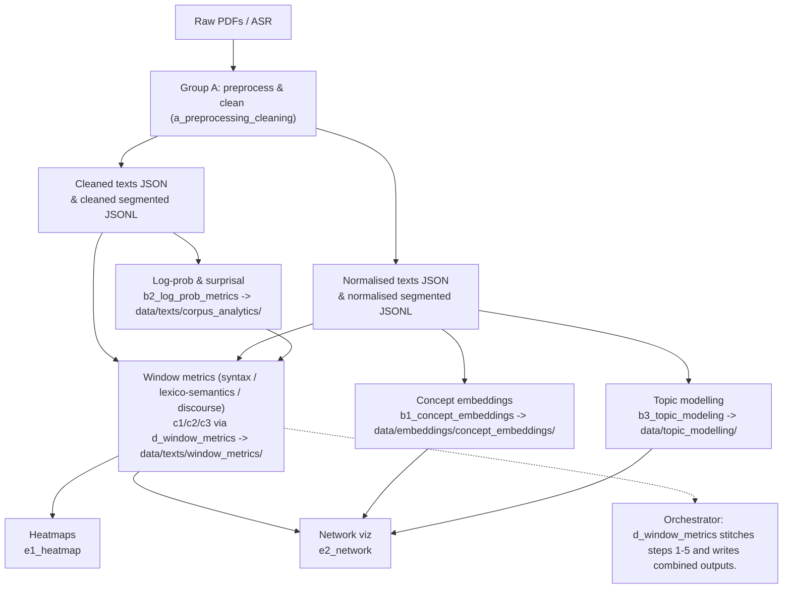

# Textual Emphasis Analysis

Python 3.10

A pipeline for analyzing textual emphasis with linguistic metrics, topic modeling, embeddings, and visualization. Most metrics operate on sliding windows of sentences so they can be aligned with topics and network structures.

## Module groups

- **Group A - preprocessing/cleaning** (`src/a_preprocessing_cleaning.py`): spaCy tokenization/lemmatization, whitespace cleaning, PDF extraction with per-book configs, optional Whisper ASR; writes cleaned/normalised text variants to `data/texts/...` (cleaned/normalised as JSON, segmented as JSONL, raw as TXT).
- **Group B - whole-text embeddings and topics**
  - `src/b1_concept_embeddings.py`: noun-phrase extraction, sentence-transformer embeddings, HDBSCAN clustering; saves to `data/embeddings/concept_embeddings/`.
  - `src/b2_log_prob_metrics.py`: Hugging Face causal LM log-probability and surprisal metrics per sentence and window (no I/O; uses `x_configs.model`).
  - `src/b3_topic_modeling.py`: sentence-level embeddings, windowed clustering, TF-IDF keywords, topic mentions; saves to `data/topic_modelling/`.
- **Group C - sentence/window analytics**
  - `src/c1_syntactics.py`: dependency depth, clause counts, complexity, syntactic graphs (`data/graphs/syntactic/`).
  - `src/c2_lexico_semantics.py`: lexical density/frequency/cohesion; supports corpus frequency merging.
  - `src/c3_discourse.py`: discourse markers, entity overlap, pronoun/tense shifts; aggregates per window.
- **Group D - orchestration**
  - `src/d_window_metrics.py`: full pipeline runner. Steps: (1) preprocess PDFs to cleaned/normalised text; (2) concept embeddings from normalised text; (3) topic modelling from normalised-segmented JSONL; (4) corpus log-prob metrics from cleaned text; (5) combined window metrics (syntax + lexico-semantic + discourse + info content) to `data/texts/window_metrics/<category>/`.
- **Group E - visualization**
  - `src/e1_heatmap.py`: heatmaps over windowed metrics.
  - `src/e2_network.py`: network views across topic/syntax/lexico-semantic outputs.
- **Shared helpers**: `src/x_configs.py` (spaCy loader defaults, window size, model placeholder) and `src/z_utils.py` (sliding-window aggregation, JSON/path helpers for texts, embeddings, graphs, topics).

## Architecture flow

## Data layout

- `data/texts/cleaned_texts/<category>/*.json`: inputs for corpus/window metrics (full text under `text` key).
- `data/texts/normalised_texts/<category>/*.json`: inputs for concept embeddings/networking (full text under `text` key).
- `data/texts/cleaned_segmented_texts/<category>/*.jsonl` and `data/texts/normalised_segmented_texts/<category>/*.jsonl`: sentence-level JSON Lines.
- `data/texts/window_metrics/<category>/*.json`: combined outputs from the orchestrator.
- `data/topic_modelling/`, `data/embeddings/concept_embeddings/`, `data/graphs/{network,syntactic}/`: downstream artifacts from group B/C/E modules.
- Raw PDFs expected under `data/raw_texts/` (stored as TXT after extraction); other intermediate folders can be added as preprocessing requires.

## Notes

- Set `x_configs.model` to the desired causal LM before running log-prob metrics.
- Several modules still have TODOs and may assume corpus frequency data exists.
- Tests are not present yet; `pytest` is included in `requirements.txt` for future coverage.
