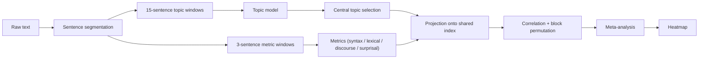

# Textual Emphasis Analysis

Python 3.10.

## Introduction / overview
The pipeline analyzes textual emphasis using linguistic metrics, topic modeling, embeddings, and visualization. Windowed metrics are computed over sliding sentence windows (default size 3, stride 1) so syntax/lexico-semantics/discourse/surprisal can be aligned to topic windows and compared across shared sentence indices.

## Pipeline diagram

## Running
To run on your own texts:
1. Install requirements: `pip install -r requirements.txt`.
2. Add raw PDFs under `data/texts/raw/<genre>/<author>/`. If needed, add extraction/cleaning rules in
   `src/x_configs.py` (`BOOK_CONFIGS` or `WEB_CONFIGS`) and add new genres to `GENRES`.
3. From repo root, run the full pipeline (ensure `PYTHONPATH=src` so both `src.*` and top-level imports resolve):
   - PowerShell: `$env:PYTHONPATH="src"; python -m src.f_orchestrator`
   - bash: `PYTHONPATH=src python -m src.f_orchestrator`
4. From repo root, generate figures (same `PYTHONPATH`):
   - PowerShell: `$env:PYTHONPATH="src"; python -m src.e_visualisations`
   - bash: `PYTHONPATH=src python -m src.e_visualisations`

Notes:
- The orchestrator runs preprocessing, embeddings, topic modeling, corpus metrics, window metrics, and dashboard correlations.
- Outputs are written under `data/analytics/` and `data/results/`.

## Central topics (top 60th percentile; capped to top_n)
- Centrality selection:
  - Uses topic stats: coherence, exclusivity, prevalence, persistence.
  - Min-max normalize each metric across topics; sum normalized values for a score (only metrics present for that topic).
  - Rank by score; compute the 60th percentile threshold; keep topics with score >= threshold.
- Metric definitions (from topic modeling):
  - Prevalence (soft mean): sum of topic scores across non-noise windows / number of non-noise windows.
    - topic_scores already filtered by score_threshold/top_k at topic modeling time.
  - Persistence (top-k presence): mean run length of consecutive windows where the topic appears in topic_scores (non-noise).
  - Coherence: for each topic, use window texts where it appears; build binary doc-term matrix; compute NPMI for keyword pairs with co-occurrence > 0; coherence is mean NPMI (0 if none).
  - Exclusivity: term_topic_count = number of topic-docs containing the term (tfidf > 0).
    exclusivity_term = 1 - ((count - 1) / (num_topics - 1)), clipped to [0,1]; if num_topics <= 1, exclusivity_term = 1.
    Exclusivity is mean across the topic keywords.

## Window metrics and dashboard summaries
- Unexpectedness (window-level, used in correlations):
  - token_weighted_mean_surprisal: token-weighted mean of sentence mean_surprisal in the window.
  - token_weighted_surprisal_variance: pooled token variance using sentence mean_surprisal + sentence surprisal_variance, weighted by num_tokens.
  - max_token_surprisal: max token surprisal within the window.
- Unexpectedness (text-level dashboard row, not currently written by `run_dashboard` in `d2_dashboard`):
  - avg_token_surprisal: token-weighted mean of sentence mean_surprisal across all sentences with num_tokens > 0.
  - max_token_surprisal: max across all token surprisals in the text.
  - surprisal_variance: pooled token variance using sentence mean_surprisal + sentence surprisal_variance, weighted by num_tokens.
- Lexical (window-level, used in correlations):
  - lexical_density_per_token: token-weighted content/total tokens in window (content POS in {NOUN, VERB, ADJ, ADV}; tokens exclude punctuation).
  - lexical_diversity_mattr.mattr_score: MATTR over window tokens (lowercased, no punct/space) using mattr_window_size.
  - avg_word_freq: token-weighted mean of per-sentence avg_word_freq, weighted by avg_word_freq_token_count (alpha tokens).
  - normalized_freq: same weighting, normalized against global_avg_freq if provided (else avg_word_freq).
  - information_content: token-weighted mean of per-sentence information_content, weighted by information_content_token_count (alpha tokens).
- Lexical (text-level dashboard row): mean across windows of the above window-level values.
- Structure (window-level, used in correlations):
  - clause_counts_per_token by clause type; clause_ratios by clause type.
  - avg_dependents_per_head by clause type.
  - avg_tokens_per_sentence, avg_mean_dependency_distance, median_depth, max_depth, depth_skew, punctuation_per_token.
- Structure (text-level dashboard row):
  - max_dependency_depth: max across windows of max_depth (window max_depth is the max of sentence max_depth).
  - clause_density: mean across windows of sum(clause_counts_per_token).
  - avg_dependents_per_head: mean across windows of the per-window mean across clause types.
  - clause_ratios: mean across windows.
  - avg_mean_dependency_distance: mean across windows.
  - avg_median_depth: mean across windows.
  - depth_skew: mean across windows.
  - punctuation_per_token: mean across windows.
- Discourse (window-level, used in correlations):
  - explicit_connectives_per_token, modality_per_token, connective_counts_per_token by category,
    tense_shift, entity_overlap_ratio, content_overlap_ratio, pronoun_ratio.
- Discourse (text-level dashboard row): mean across windows of explicit_connectives_per_token, modality_per_token,
  connective_counts_per_token, tense_shift, and entity_overlap_rate.

## Correlations
- Per text:
  - Correlations are computed only for central topics (even in the "topics" report).
  - For each central topic, correlate window metrics with soft topic scores (overlap-weighted to the metric window);
    compute Pearson r with block permutation p-values, and binary correlations from score > 0.
  - Central topic presence (binary any central, using hard mentions overlapping the window) correlated with window metrics.
- Per genre:
  - Central topic presence correlations aggregated across texts via Fisher z for r (weighted by n-3; only n > 3)
    and Stouffer for p-values (weights sqrt(n-3), sign from r).

## Notes
- Tokenization:
  - discourse token counts include punctuation (spaces excluded);
  - syntax clause counts exclude punctuation but depth/complexity include punctuation;
  - lexico-semantics uses non-punct tokens for lexical density, alpha tokens for information content and avg word freq;
  - MATTR uses non-space/non-punct tokens;
  - log probs use LM subword pieces with offsets.
- Segmentation:
  - topic modeling uses normalised segmented sentences;
  - windowed metrics use cleaned segmented sentences for alignment;
  - concept embeddings use full normalised text.
- Correlations:
  - metric list is flattened per-window metrics (sentence indices stripped).
- Significance:
  - Pearson r omitted when n < 2 or either variable is constant;
  - block permutation with contiguous blocks (default block_size=5, permutations=2000), two-sided on |r|;
    p = (count + 1) / (permutations + 1); RNG fixed (np.random.default_rng(42)).
- Aggregation:
  - Fisher z uses r clipped to +/-0.999999; z_bar weighted by n-3; r_bar = tanh(z_bar).
  - Stouffer uses two-sided p, sign by r, weight sqrt(n-3); p clamped to [1e-15, 1-1e-15].
  - rows with n <= 3 are skipped.
- Inputs and outputs:
  - Raw PDFs expected under `data/texts/raw/` (organized by genre/author).
  - Processed texts live under `data/texts/processed/`; analytics outputs under `data/analytics/` (corpus_analytics, topic_modelling, window_metrics, embeddings); results under `data/results/` (dashboard, figures).
- Set `MODEL_CONFIGS["causal_lm"]` in `src/x_configs.py` to the desired causal LM before running log-prob metrics.
